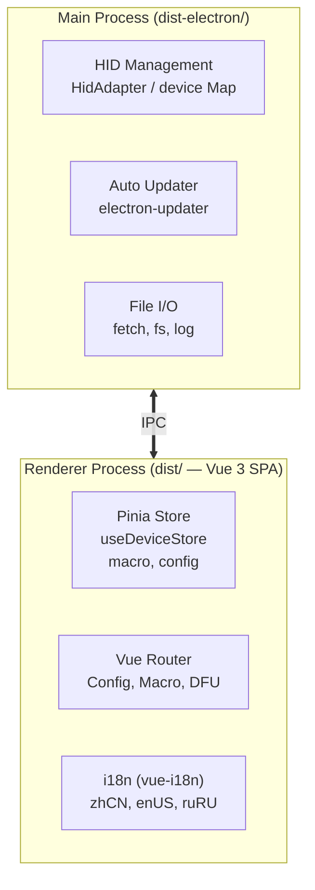
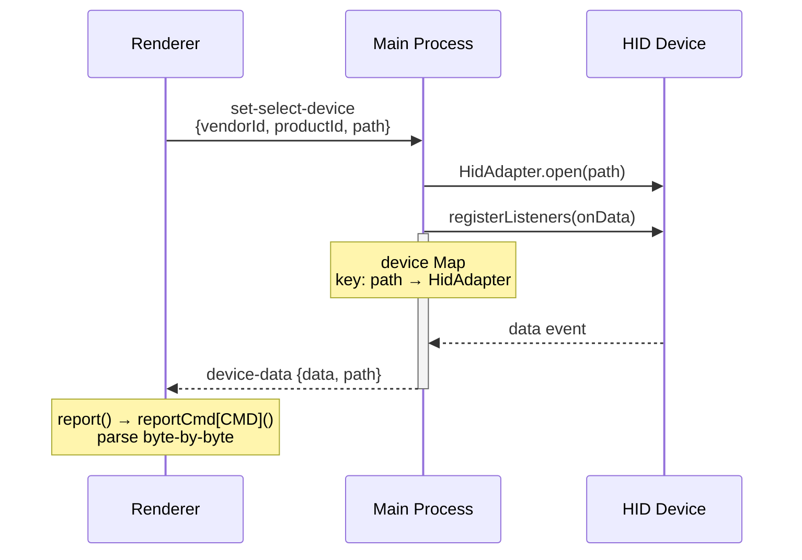
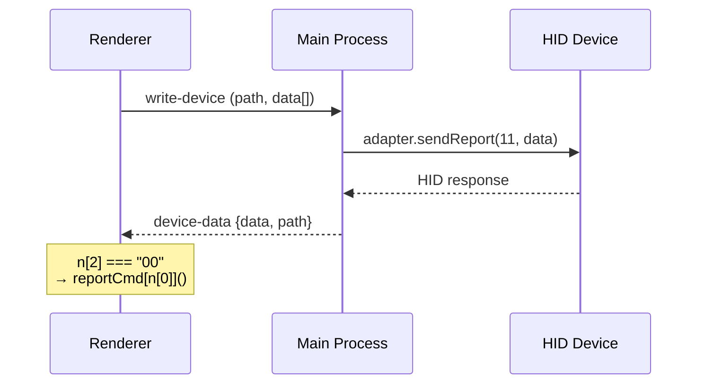

# Architecture

## Process Model



## Data Flow

### Device Connection



### Sending Commands



## Key Files

| File | Role | Source |
|---|---|---|
| `dist-electron/main.js` | Main process entry | Bundled Electron code |
| `dist-electron/preload.mjs` | IPC bridge to renderer | Manual |
| `src/native/hidAdapter.mjs` | HID abstraction layer | Manual (only source file) |
| `dist/assets/nodeHIDConfiguration-*.js` | HID command/response logic | Vue build output |
| `dist/assets/index-*.js` | Vue app, router, stores, i18n | Vue build output |
| `dist/index.html` | SPA entry point | Vue build output |

## IPC Channels

| Channel | Direction | Format | Source |
|---|---|---|---|
| `set-select-device` | Renderer → Main | `{vendorId, productId, path}` | `main.js:15454` |
| `write-device` | Renderer → Main | `(path, number[])` | `main.js:15339` |
| `close-device` | Renderer → Main | `(path)` | `main.js:15345` |
| `device-data` | Main → Renderer | `{data: DataView, path: string}` | `main.js:15333` |
| `get-firmware` | Renderer → Main | `(url)` → `ArrayBuffer` | `main.js:15511` |
| `set-theme` | Renderer → Main | theme string | `main.js:15508` |
| `update-retry` | Renderer → Main | — | `main.js:15478` |
| `update-available` | Main → Renderer | progress info | `main.js:15467` |
| `update-progress` | Main → Renderer | progress % | `main.js:15469` |
| `update-downloaded` | Main → Renderer | — | `main.js:15472` |
| `update-error` | Main → Renderer | error message | `main.js:15475` |

Full details in [IPC_API.md](./ipc-api.md).

## Security Configuration

Source: `main.js:15396-15407`

```js
webPreferences: {
    webviewTag: true,
    webSecurity: false,        // insecure — allows cross-origin
    contextIsolation: false,   // insecure — renderer can access Node
    nodeIntegration: true,     // insecure — renderer has full Node
    devTools: false,
}
```

> **Note**: `contextIsolation: false` + `nodeIntegration: true` gives the renderer full access to Node.js. This is non-standard for modern Electron (security risk). However, the `preload.mjs` also provides `contextBridge` for a safer approach.

## Startup Sequence

```text
1. Pe.whenReady()
2. Le.createMainWindow()
   → BrowserWindow dengan webPreferences di atas
   → loadURL: file://dist/index.html
3. did-finish-load
   → autoUpdater.checkForUpdates(true)
   → IPC listener: update-retry
4. System tray dibuat
5. Renderer: Vue app mount → router → halaman default
6. Renderer: HID device discovery → koneksi otomatis
```

## Dependencies Graph

```text
package.json
├── electron          → Runtime
├── electron-builder  → Build/packaging
├── electron-updater  → Auto update
├── electron-log      → Logging
├── node-hid          → HID communication
├── axios             → HTTP client
├── vue               → UI framework
├── pinia             → State management
├── vue-router        → SPA routing
└── vue-i18n          → Internationalization
```
